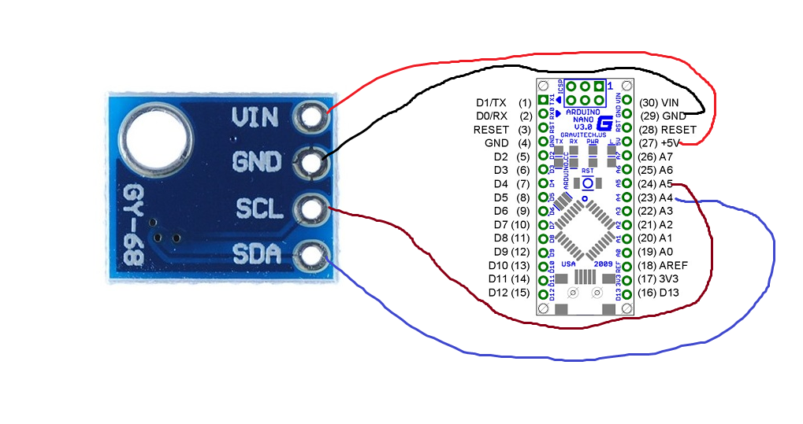

# Used modules


[Wiring in fritzing format](Meteostation.fzz)

## Arduino UNO

##  Ethernet on chip ENC28J60

[Library](https://github.com/jcw/ethercard)

## CO2 Sensor TGS4161


 * [Product information](tgs4161.pdf)
 * [TGS4161 DataSheet](TGS4161Dtl.pdf)

 This module can mesure [PPM](https://en.wikipedia.org/wiki/Parts-per_notation#ppm) ("parts per million" - co2 concentration value) from 350 to 10000 ppm. [Read](https://en.wikipedia.org/wiki/Carbon_dioxide#Toxicity) about CO2 toxity for humans.

 The dependency between actual ppm value and the voltage output provided by the sensor is exponential: `c=exp((v+a)/b)`, where

  * `c` - the concentration of co2 (in ppm)
  * `v` - sensor's output voltage *in millivolts* (pin `Aout`)
  * `a`, `b` - constants which have to be calibrated depending on specific sensor

  For arduino if `s` is signal then voltage `v` will be `v=(s*5000)/1024`. So having two different `v1` and `v2` and corresponding concentrations `c1` and `c2` we can find:

   * Let `z1 = Ln(c1)`, `z2 = Ln(c2)`, `d=z1-z2`
   * `a = (v1*z2-v2*z1)/d`
   * `b = (v1-v2)/d`

   [Calculation in instacalc](http://instacalc.com/40408)

## Temperature and humidity sensor [DHT11](http://playground.arduino.cc/Main/DHT11Lib)


## Presure sensor BMP180
Can measure pressure, temperature and altitude.

[MMP180 Library](https://github.com/sparkfun/BMP180_Breakout_Arduino_Library)



## Voltage stabilizator LM7805CV. [Connection scheme](http://www.ruselectronic.com/news/stabilizatory-naprjazhjenija/)


# OpenHab

 * OpenHab default location: `/opt/openhab`
 * [OpenHab](http://www.openhab.org/getting-started/) starting: `./start_debug.sh`
 * [OpenHab url](http://localhost:8080) or [demo sitemap](http://localhost:8080/openhab.app?sitemap=demo)

## Items `solvek.items`

```
/* Meteostation */
Group Meteostation  (All)

Number MS_Temperature    "Temperature [%d °C]"  <temperature> (Meteostation)
Number MS_Humidity   "Humidity [%d %%]"  <temperature> (Meteostation)

Group MS_Advanced  (Meteostation)
Number MS_CO2_Raw   "CO2 raw [%d]"  (MS_Advanced)
String  String_MS_raw     "Raw udp [%s]"   (MS_Advanced) {udp="<[0.0.0.0:*:'REGEX(meteostation;(.*))']"}
Number CO2_Raw_Chart_Period   "Chart Period"
```

## Sitemap `default.sitemap`

```
  Frame label="Meteostation"{
    Text item=MS_Temperature   {
      Chart item=MS_Temperature period=D refresh=30000
    }
    Text item=MS_Humidity

    Text label="Advanced" {
        Text item=MS_CO2_Raw

        Switch item=CO2_Raw_Chart_Period label="Chart Period" mappings=[0="Hour", 1="Day", 2="Week"]
        Chart item=MS_CO2_Raw period=h refresh=6000 visibility=[CO2_Raw_Chart_Period==0, CO2_Raw_Chart_Period=="Uninitialized"]
        Chart item=MS_CO2_Raw period=D refresh=30000 visibility=[CO2_Raw_Chart_Period==1]
        Chart item=MS_CO2_Raw period=W refresh=30000 visibility=[CO2_Raw_Chart_Period==2]

        Text item=String_MS_raw
    }
  }
  ```

## Rules `solvek.rules`

```
// Solvek rules
rule "Parse raw meteostation"
when
  Item String_MS_raw received update
then
  val String ms_val = String_MS_raw.state.toString

  executeCommandLine(String::format("/media/data/big_storage/Projects/electronics/co2/append.sh %2$s;%1$s /media/data/big_storage/Temp/meteostation.csv", ms_val, now))
  logInfo("mscsv", ms_val)

  val String[] parts = ms_val.split(";")

  var Number temperature = Integer::parseInt(parts.get(2))
  sendCommand(MS_Temperature, temperature)

  var Number humidity = Integer::parseInt(parts.get(3))
  postUpdate(MS_Humidity, humidity)

  var Number co2_raw = Integer::parseInt(parts.get(1))
  postUpdate(MS_CO2_Raw, co2_raw)
  ```

  ## `rrd4j.persist`

  ```
  // persistence strategies have a name and a definition and are referred to in the "Items" section
Strategies {
  // for rrd charts, we need a cron strategy
  everyMinute : "0 * * * * ?"
}

Items {
  MS_CO2_Raw,MS_Temperature,DemoSwitch,NoOfLights,Window_GF_Toilet,Heating* : strategy = everyChange, everyMinute, restoreOnStartup

  // let's only store temperature values in rrd
  Temperature*,Weather_Chart* : strategy = everyMinute, restoreOnStartup
}
```
